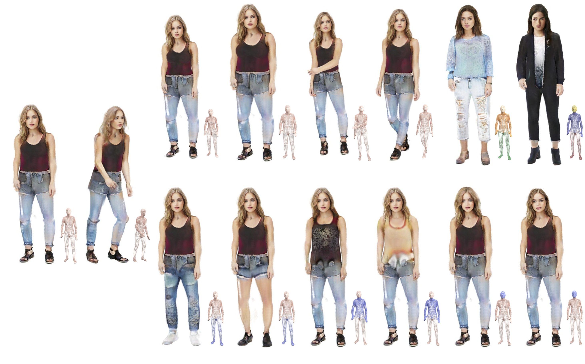

<div align="center">

<h1>VeRi3D: Generative Vertex-based Radiance Fields for 3D Controllable Human Image Synthesis (ICCV2023)</h1>

<div>
Xinya Chen<sup>1</sup>, Jiaxin Huang<sup>1</sup>, Yanrui Bin<sup>2</sup>, Lu Yu<sup>1</sup>, Yiyi Liao<sup>1*</sup>
</div>
<div>
    <sup>1</sup>Zhejiang University&emsp; <sup>2</sup>Huazhong University of Science and Technology&emsp; <sup>*</sup>corresponding author
</div>

<h4 align="center">
  <a href="https://xdimlab.github.io/VeRi3d/" target='_blank'>[Project Page]</a>
  <a href="https://openaccess.thecvf.com/content/ICCV2023/papers/Chen_VeRi3D_Generative_Vertex-based_Radiance_Fields_for_3D_Controllable_Human_Image_ICCV_2023_paper.pdf" target='_blank'>[paper]</a>
</h4>



**Figure:** Overview of VeRi3D.

</div>

## Requirements

NVIDIA GPUs are required for this project.
The training codes have been tested on NVIDIA V100, NVIDIA A100, NVIDIA RTX3090.
We recommend using anaconda to manage the python environments.

```bash
conda create --name veri3d python=3.8
conda activate veri3d
conda install pytorch==1.7.1 torchvision==0.8.2 torchaudio==0.7.2 cudatoolkit=11.0 -c pytorch
conda install -c fvcore -c iopath -c conda-forge fvcore iopath
conda install pytorch3d -c pytorch3d
pip install -r requirements.txt
```

## TODO

- [x] Code release.
- [x] Training scripts.
- [x] Inference scripts.

## Training

### DeepFashion

#### Download SMPL Models & Processed Datasets

Register and download SMPL models [here](https://smpl.is.tue.mpg.de/). Put the downloaded models in the folder smpl_models. Only the neutral one is needed. The folder structure should look like

```
./
├── ...
└── smpl_models/
    ├── smpl/
        └── SMPL_NEUTRAL.pkl
```

DeepFashion dataset are borrowed from [EVA3D](https://github.com/hongfz16/EVA3D). Please follow their instructions to get the dataset and put assets/train_list.txt under datasets/DeepFashion/.

#### Commands

```bash
bash scripts/train_deepfashion_512x256_veri3d.sh
```

Intermediate results will be saved under `checkpoint/train_deepfashion_512x256_veri3d/volume_renderer/samples` every 100 iterations. The first line presents inference images from EMA generator. The second line present one inference sample of the training generator and one sample from the training dataset.

## Inference
The pretrained models are available [here](https://drive.google.com/drive/folders/1fxgXsEi5yr9nA6zSu-_Y5830uYOmXc08?usp=sharing).
#### Commands
Run the following script to perform pose control (with AIST++ pose), shape control, view control, appearance control and part-level control.

```bash
bash scripts/control_demo_deepfashion_512x256.sh
```


## Acknowledgements

The implementation is built on source codes shared by [EVA3D](https://github.com/hongfz16/EVA3D). We thank the authors for their generosity to release code.

## Citation

If you find our work useful, please consider citing:

```BibTeX
@InProceedings{Chen_2023_ICCV,
    author    = {Chen, Xinya and Huang, Jiaxin and Bin, Yanrui and Yu, Lu and Liao, Yiyi},
    title     = {VeRi3D: Generative Vertex-based Radiance Fields for 3D Controllable Human Image Synthesis},
    booktitle = {Proceedings of the IEEE/CVF International Conference on Computer Vision (ICCV)},
    month     = {October},
    year      = {2023},
    pages     = {8986-8997}
}
```
